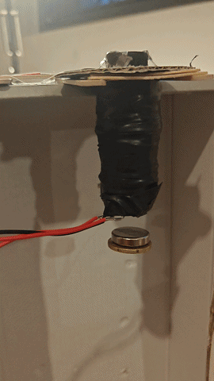
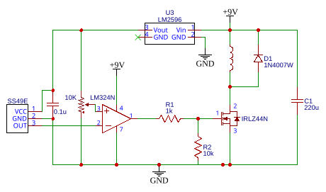
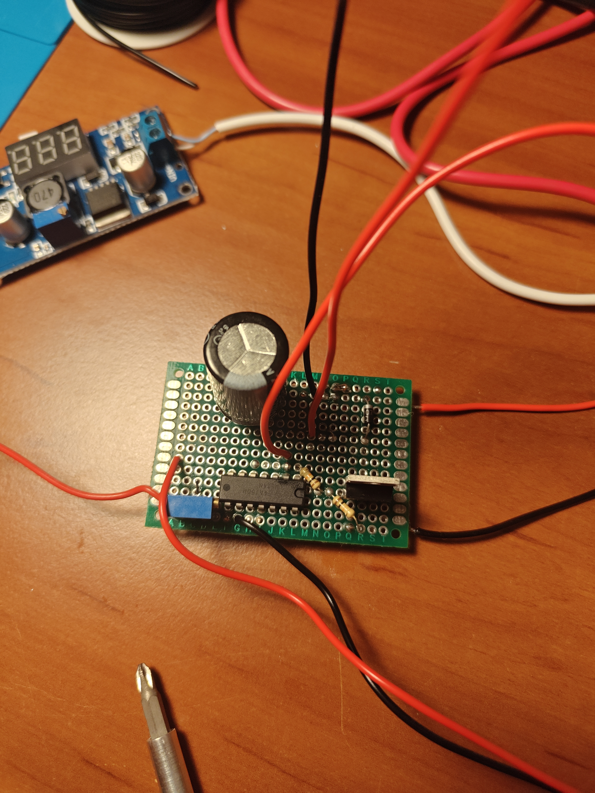
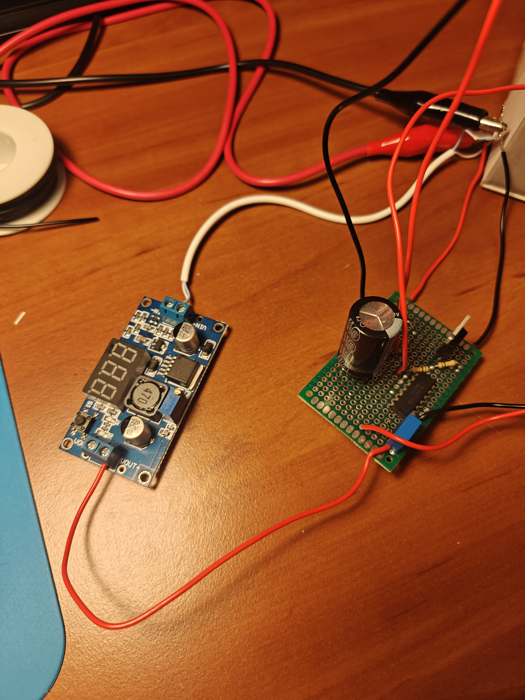

# Analog-Maglev-Control-System

# Analog Closed-Loop Magnetic Levitation System

## Project Overview
This project demonstrates the design and implementation of an analog closed-loop control system capable of levitating a permanent neodymium magnet. The system utilizes a custom-wound electromagnet and achieves stable levitation through a continuous Proportional (P) control loop, purely driven by hardware (op-amps) without the use of microcontrollers or digital signal processing.

*Caption: Stable levitation achieved utilizing continuous analog feedback.*

## Hardware Architecture
The system is built upon four primary functional blocks:
* **Actuator:** A custom-built electromagnet consisting of 635 turns of enameled copper wire wound around an M12 carbon steel core. 
* **Feedback Sensor:** An SS49E Linear Hall-Effect sensor, strategically positioned at the base of the electromagnet core (with a non-magnetic spacer to prevent saturation) to measure the real-time distance of the levitating magnet.
* **Error Amplifier (P-Controller):** An LM324N operational amplifier configured as a differential amplifier. It continuously compares the sensor's output ($V_{hall}$) against an adjustable reference voltage ($V_{ref}$) set by a 10kΩ precision multi-turn potentiometer.
* **Power Stage:** A logic-level N-Channel MOSFET (IRLZ44N) operating in its linear (triode/active) region. It dynamically regulates the current flowing through the electromagnet (up to ~3.5A at 9V) based on the output of the op-amp.

### System Topology & Power Domains
To ensure signal integrity and sufficient gate drive, the system employs split power domains:
* **9V Power Net:** Supplies the high-current electromagnet and the LM324N operational amplifier.
* **5V Power Net:** Generated by an onboard LM2596 buck converter, dedicated strictly to powering the SS49E Hall sensor and the reference voltage potentiometer to prevent overvoltage damage and ensure stable analog readings.

*Caption: Complete system schematic featuring split power domains and analog feedback loop.*

## Engineering Challenges & Troubleshooting
During the development and prototyping phase, several practical engineering challenges were identified and resolved:

1.  **MOSFET Gate Drive Limitations (Op-Amp Headroom):** Initially, powering the LM324N from the 5V rail restricted its maximum output voltage to ~3.5V. This was insufficient to fully enhance the IRLZ44N, bottlenecking the electromagnet's current to 0.5A. The topology was revised to power the LM324N directly from the 9V rail, allowing the gate voltage to swing high enough to fully open the MOSFET channel, delivering the required 3.5A.

2.  **Mechanical vs. Magnetic Equilibrium (Biasing):**
    A fundamental instability occurred where the passive magnetic attraction between the neodymium magnet and the iron core exceeded the force of gravity. Even when the controller dropped the coil current to zero, the magnet would snap upwards. This was resolved mechanically by adding a specific non-magnetic ballast (a Nordic Gold coin) to the levitating object. This shifted the equilibrium point, allowing gravity to overcome the passive pull and forcing the active control loop to take over.

3.  **High-Current Routing & Thermal Mass on Perfboard:**
    Routing a continuous 3.5A through a standard perfboard required reinforcing the traces with thick copper wire. The extreme thermal mass of these wires caused heat dissipation issues during soldering (cold joints). This was mitigated by utilizing a high-temperature chisel tip (400°C), active pre-tinning, and copious amounts of flux to ensure low-resistance, high-current joints.

*Caption: Final perfboard implementation highlighting the power stage and control logic separation.*

## Future Enhancements
* **Implementation of a PD/PID Controller:** Adding a Derivative (D) term to the analog computer using capacitors to introduce system damping and eliminate pendulum-effect oscillations.
* **Custom PCB Design:** Migrating the perfboard prototype to a dedicated printed circuit board with optimized ground planes (star grounding) for better EMI noise rejection.